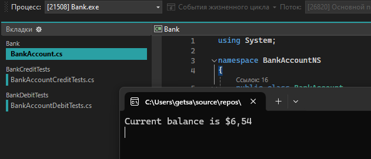
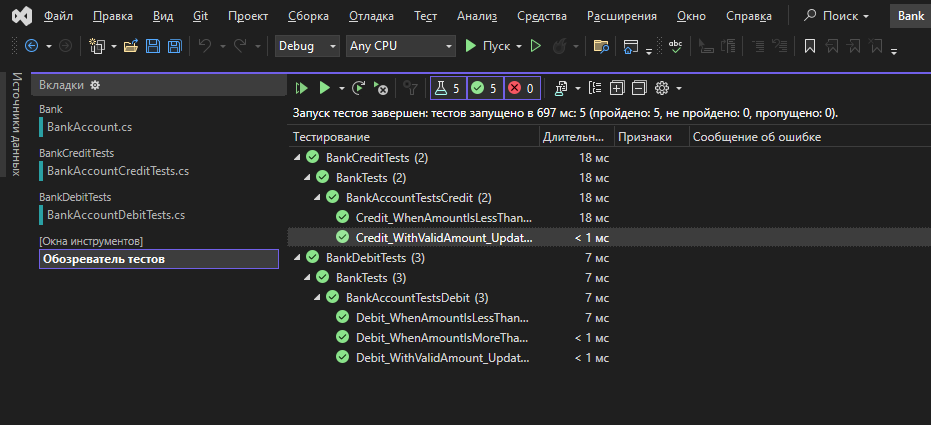

# Практическая работа №6  часть 1
## Создание автоматизированных Unit-тестов  

### Цель работы  
провести тестирование разработанных программных модулей с использованием средств автоматизации Microsoft Visual Studio методом "белого ящика".

#### Скриншоты результатов

#### Вывод по проделанной работе
В ходе работы были успешно разнесены тесты по разным проектам, что позволило улучшить структуру и читаемость кода. Теперь:

- Созданы два отдельных тестовых проекта BankDebitTests и BankCreditTests, что позволяет тестировать дебетовые и кредитные операции независимо друг от друга;
- Проверена работоспособность – тесты успешно запущены через Обозреватель тестов, что подтверждает корректность реализации;
- Отсутствие ошибок в программном коде.
